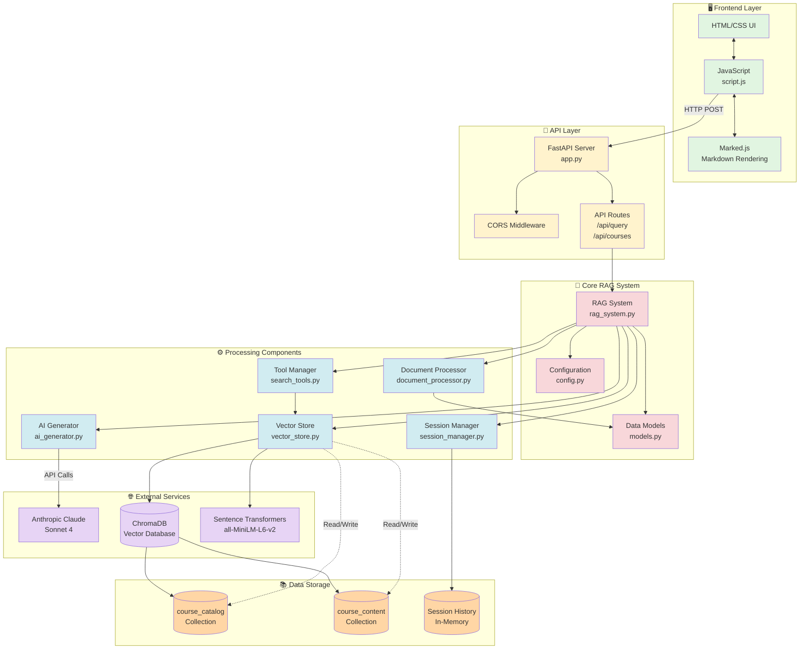
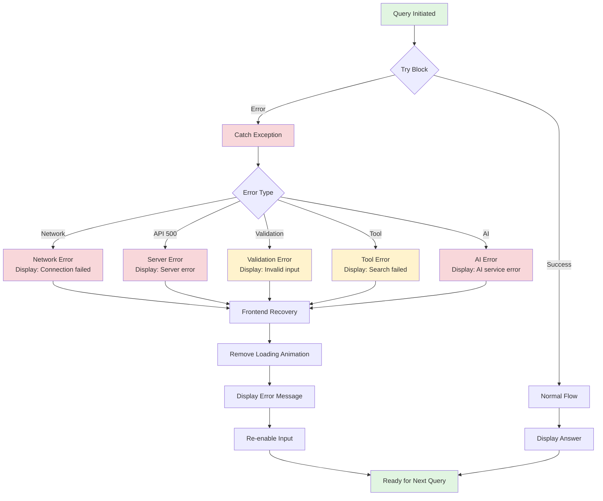

# Query Flow Diagram - RAG Chatbot System

## Complete User Query Flow: Frontend → Backend → Response

This document illustrates the complete journey of a user query through the RAG chatbot system.

---

## Sequence Diagram

```mermaid
sequenceDiagram
    participant User
    participant Frontend as Frontend<br/>(script.js)
    participant API as FastAPI<br/>(app.py)
    participant RAG as RAG System<br/>(rag_system.py)
    participant Session as Session Manager
    participant AI as AI Generator<br/>(ai_generator.py)
    participant Claude as Claude API<br/>(Anthropic)
    participant Tools as Tool Manager<br/>(search_tools.py)
    participant Vector as Vector Store<br/>(vector_store.py)
    participant Chroma as ChromaDB

    User->>Frontend: Types question & clicks send
    activate Frontend
    Frontend->>Frontend: Disable input<br/>Show loading animation
    Frontend->>Frontend: Display user message
    
    Frontend->>API: POST /api/query<br/>{query, session_id}
    activate API
    
    API->>API: Validate request
    API->>Session: Create/get session
    Session-->>API: session_id
    
    API->>RAG: query(query, session_id)
    activate RAG
    
    RAG->>Session: Get conversation history
    Session-->>RAG: Previous messages
    
    RAG->>AI: generate_response()<br/>(query, history, tools)
    activate AI
    
    AI->>AI: Build system prompt<br/>with conversation context
    
    AI->>Claude: API Call #1<br/>messages.create()<br/>(with tools)
    activate Claude
    
    Note over Claude: Claude analyzes query<br/>Decides: Search or answer directly?
    
    alt Course-specific question
        Claude-->>AI: stop_reason: "tool_use"<br/>tool: search_course_content
        deactivate Claude
        
        AI->>Tools: execute_tool()<br/>(query, course_name, lesson_number)
        activate Tools
        
        Tools->>Vector: search()<br/>(query, filters)
        activate Vector
        
        alt Course name provided
            Vector->>Chroma: Query course_catalog<br/>(semantic course resolution)
            Chroma-->>Vector: Best matching course title
        end
        
        Vector->>Vector: Build metadata filters<br/>(course_title, lesson_number)
        
        Vector->>Chroma: Query course_content<br/>(semantic search with filters)
        Chroma-->>Vector: Top 5 relevant chunks<br/>(with embeddings)
        
        Vector-->>Tools: SearchResults<br/>(documents, metadata, distances)
        deactivate Vector
        
        Tools->>Tools: Format results<br/>Add course/lesson context<br/>Track sources
        
        Tools-->>AI: Formatted search results
        deactivate Tools
        
        AI->>AI: Build messages with<br/>tool results
        
        AI->>Claude: API Call #2<br/>messages.create()<br/>(with tool results)
        activate Claude
        
        Note over Claude: Claude synthesizes answer<br/>from retrieved context
        
        Claude-->>AI: Final response text
        deactivate Claude
        
    else General knowledge question
        Claude-->>AI: Direct answer<br/>(no tool use)
        deactivate Claude
    end
    
    AI-->>RAG: Generated answer
    deactivate AI
    
    RAG->>Tools: get_last_sources()
    Tools-->>RAG: Source list
    
    RAG->>Tools: reset_sources()
    
    RAG->>Session: add_exchange()<br/>(query, response)
    
    RAG-->>API: (answer, sources)
    deactivate RAG
    
    API->>API: Format QueryResponse<br/>{answer, sources, session_id}
    
    API-->>Frontend: JSON Response
    deactivate API
    
    Frontend->>Frontend: Remove loading animation
    Frontend->>Frontend: Render markdown answer
    Frontend->>Frontend: Display sources (collapsible)
    Frontend->>Frontend: Re-enable input
    
    Frontend-->>User: Display answer with sources
    deactivate Frontend
```

---

## Architecture Flow Diagram

```mermaid
flowchart TD
    Start([User Types Question]) --> Input[Frontend Input Handler]
    
    Input --> Disable[Disable Input & Show Loading]
    Disable --> Display[Display User Message]
    Display --> POST[POST /api/query]
    
    POST --> Validate[FastAPI: Validate Request]
    Validate --> CheckSession{Session Exists?}
    
    CheckSession -->|No| CreateSession[Create New Session]
    CheckSession -->|Yes| GetHistory[Get Conversation History]
    CreateSession --> GetHistory
    
    GetHistory --> RAGQuery[RAG System: query method]
    
    RAGQuery --> AIGen[AI Generator: generate_response]
    
    AIGen --> BuildPrompt[Build System Prompt + Context]
    BuildPrompt --> ClaudeCall1[Claude API Call #1<br/>with Tools]
    
    ClaudeCall1 --> Decision{Claude Decision}
    
    Decision -->|General Question| DirectAnswer[Return Direct Answer]
    Decision -->|Needs Search| ToolUse[Tool Use: search_course_content]
    
    ToolUse --> ParseParams[Parse: query, course_name, lesson_number]
    ParseParams --> SearchExec[Execute Search Tool]
    
    SearchExec --> ResolveCourse{Course Name<br/>Provided?}
    
    ResolveCourse -->|Yes| SemanticCourse[Semantic Search in course_catalog<br/>Find best matching course]
    ResolveCourse -->|No| BuildFilter[Build Metadata Filter]
    SemanticCourse --> BuildFilter
    
    BuildFilter --> VectorSearch[ChromaDB Vector Search<br/>on course_content]
    
    VectorSearch --> EmbedQuery[Generate Query Embedding<br/>all-MiniLM-L6-v2]
    EmbedQuery --> FindSimilar[Find Top 5 Similar Chunks<br/>Cosine Similarity]
    
    FindSimilar --> FormatResults[Format Results with<br/>Course & Lesson Context]
    FormatResults --> TrackSources[Track Sources]
    
    TrackSources --> ReturnResults[Return Formatted Results]
    ReturnResults --> ClaudeCall2[Claude API Call #2<br/>with Tool Results]
    
    ClaudeCall2 --> Synthesize[Claude Synthesizes Answer<br/>from Retrieved Context]
    
    Synthesize --> FinalAnswer[Return Final Answer]
    DirectAnswer --> Merge[Merge Paths]
    FinalAnswer --> Merge
    
    Merge --> ExtractSources[Extract Sources from Tools]
    ExtractSources --> UpdateHistory[Update Conversation History]
    
    UpdateHistory --> ReturnRAG[Return answer + sources]
    ReturnRAG --> FormatJSON[Format JSON Response]
    
    FormatJSON --> SendResponse[Send Response to Frontend]
    SendResponse --> RemoveLoading[Remove Loading Animation]
    
    RemoveLoading --> RenderMarkdown[Render Markdown Answer]
    RenderMarkdown --> ShowSources[Display Sources Collapsible]
    ShowSources --> EnableInput[Re-enable Input]
    
    EnableInput --> End([User Sees Answer])
    
    style Start fill:#e1f5e1
    style End fill:#e1f5e1
    style ClaudeCall1 fill:#fff3cd
    style ClaudeCall2 fill:#fff3cd
    style VectorSearch fill:#d1ecf1
    style SemanticCourse fill:#d1ecf1
    style POST fill:#f8d7da
    style SendResponse fill:#f8d7da
```



---

## Component Architecture



---

## Data Flow by Stage

### Stage 1: User Input → API Request
```
User Input
    ↓
Frontend validates input
    ↓
Display user message
    ↓
Show loading animation
    ↓
HTTP POST /api/query
    {
        "query": "What is MCP?",
        "session_id": "abc123" or null
    }
```

### Stage 2: API Processing
```
FastAPI receives request
    ↓
Validate request body (Pydantic)
    ↓
Check/Create session_id
    ↓
Pass to RAG System
```

### Stage 3: RAG System Orchestration
```
RAG System receives query
    ↓
Get conversation history (if session exists)
    ↓
Prepare tools (CourseSearchTool)
    ↓
Pass to AI Generator with context
```

### Stage 4: AI Decision & Execution
```
AI Generator → Claude API
    ↓
Claude analyzes query + history + available tools
    ↓
Decision Branch:
    │
    ├─→ [General Knowledge]
    │       Claude answers directly
    │       No tool use
    │
    └─→ [Course-Specific]
            Claude decides to use search tool
            Returns: tool_use block
                ↓
            Tool Manager executes search
                ↓
            Vector Store performs search
                ↓
            ChromaDB returns results
                ↓
            Tool formats results
                ↓
            Results sent back to Claude
                ↓
            Claude synthesizes final answer
```

### Stage 5: Vector Search Details (When Tool Used)
```
Search Tool receives parameters
    {
        "query": "explain MCP",
        "course_name": "Introduction to MCP",
        "lesson_number": 1
    }
    ↓
Vector Store processes:
    1. Resolve course name (semantic)
       - Query course_catalog collection
       - Find best matching course title
       - Example: "Intro MCP" → "Introduction to MCP"
    
    2. Build metadata filter
       - course_title: "Introduction to MCP"
       - lesson_number: 1
    
    3. Generate query embedding
       - Use all-MiniLM-L6-v2
       - Convert query to 384-dim vector
    
    4. Search course_content
       - Cosine similarity search
       - Filter by metadata
       - Return top 5 chunks
    
    5. Format results
       - Add course/lesson context
       - Track sources for UI
```

### Stage 6: Response Assembly
```
AI Generator returns final answer
    ↓
RAG System extracts sources
    ↓
Update conversation history
    ↓
Return (answer, sources) tuple
    ↓
FastAPI formats JSON response
    {
        "answer": "MCP stands for...",
        "sources": [
            "Introduction to MCP - Lesson 1",
            "Introduction to MCP - Lesson 2"
        ],
        "session_id": "abc123"
    }
```

### Stage 7: Frontend Rendering
```
Frontend receives JSON response
    ↓
Remove loading animation
    ↓
Parse markdown in answer
    (using marked.js)
    ↓
Render answer in chat
    ↓
Display sources in collapsible section
    ↓
Re-enable input field
    ↓
Auto-scroll to bottom
    ↓
User sees complete answer
```

---

## Key Technologies & Their Roles

| Component | Technology | Purpose |
|-----------|-----------|---------|
| **Frontend** | Vanilla JavaScript | User interface & HTTP requests |
| **API Server** | FastAPI (Python) | HTTP endpoints & request handling |
| **AI Model** | Claude Sonnet 4 | Natural language understanding & generation |
| **Tool System** | Anthropic Tool Calling | Enables AI to search when needed |
| **Vector DB** | ChromaDB | Stores & searches document embeddings |
| **Embeddings** | all-MiniLM-L6-v2 | Converts text to 384-dim vectors |
| **Chunking** | Sentence-based | 800 chars with 100 char overlap |
| **Session** | In-memory dict | Maintains conversation context |
| **Rendering** | Marked.js | Markdown to HTML conversion |

---

## Performance Characteristics

### Latency Breakdown (Typical Query)

```
Frontend Processing:         ~50ms
    - Input validation
    - UI updates
    - HTTP request prep

Network (to server):         ~50ms
    - Depends on connection

Backend Processing:          ~100ms
    - FastAPI routing
    - Session management
    - RAG system setup

AI Processing:               ~2-4 seconds
    - First Claude call:     ~1-2s
    - Tool execution:        ~500ms
    - Second Claude call:    ~1-2s

Vector Search:               ~200-500ms
    - Course resolution:     ~100ms
    - Content search:        ~200ms
    - Result formatting:     ~50ms

Response Assembly:           ~50ms
    - Source extraction
    - History update
    - JSON formatting

Network (to client):         ~50ms

Frontend Rendering:          ~100ms
    - Markdown parsing
    - DOM updates
    - Source display

━━━━━━━━━━━━━━━━━━━━━━━━━━━━━━━
Total User-Perceived Time:   ~3-5 seconds
```

### Bottlenecks & Optimizations

1. **AI API Calls** (Largest bottleneck)
   - Sequential tool calling requires 2 API calls
   - Anthropic API latency varies by load
   - Optimization: Caching common responses

2. **Vector Search** (Usually fast)
   - ChromaDB is optimized for similarity search
   - In-memory for small datasets
   - Optimization: Pre-computed embeddings

3. **Network Latency** (Variable)
   - Depends on user connection
   - Multiple round trips
   - Optimization: Response streaming (future)

---

## Configuration Values

From `config.py`:

```python
CHUNK_SIZE = 800          # Characters per chunk
CHUNK_OVERLAP = 100       # Overlapping characters
MAX_RESULTS = 5           # Top-K search results
MAX_HISTORY = 2           # Messages to remember
EMBEDDING_MODEL = "all-MiniLM-L6-v2"  # Sentence transformer
ANTHROPIC_MODEL = "claude-sonnet-4-20250514"  # AI model
```

These values balance:
- **Chunk size**: Large enough for context, small enough for precision
- **Overlap**: Prevents context loss at boundaries
- **Max results**: Enough variety without overwhelming the AI
- **History**: Recent context without token bloat

---

## Error Handling Flow



---

## Summary

This RAG chatbot system implements a sophisticated query flow that:

1. ✅ **Maintains Conversation Context** - Session management for multi-turn dialogues
2. ✅ **Makes Smart Decisions** - AI decides when to search vs. answer directly
3. ✅ **Performs Semantic Search** - Vector similarity for relevant content retrieval
4. ✅ **Handles Flexible Queries** - Fuzzy course name matching, optional filters
5. ✅ **Provides Source Citations** - Tracks and displays where answers come from
6. ✅ **Delivers Fast Responses** - Optimized pipeline with parallel operations
7. ✅ **Handles Errors Gracefully** - Comprehensive error handling throughout

The system demonstrates modern RAG architecture with tool-calling AI, semantic search, and clean separation of concerns across frontend, API, and backend layers.
